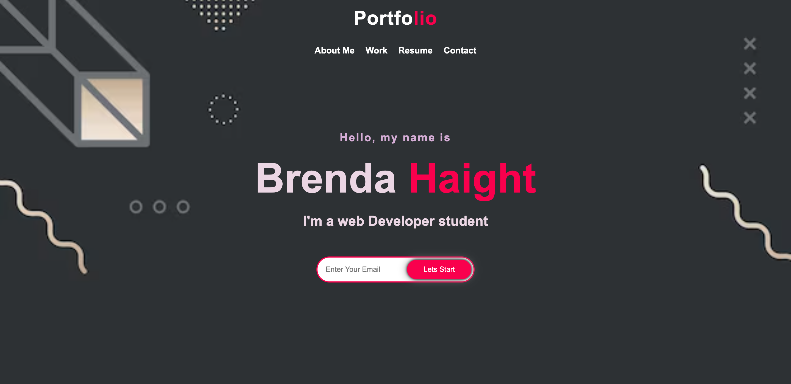

# PortFolio

Welcome to my personal portfolio! Here's how you can navigate through the different sections and learn more about me, my works, and how to contact me.

## Usage

1. Home
   Upon visiting the homepage of my portfolio, you'll find an introduction to who I am and what I do.

   

2. About Me
   Navigate to the "About Me" section to learn more about my background, interests, and aspirations. I share insights into my journey from Brazil to the United States, my fascination with coding, and my ambitions as a front-end web developer.

3. Work
   Explore the "Work" section to discover the various projects I've worked on. Each project card provides a brief description and links to additional details, such as GitHub repositories or live demos. Feel free to explore these projects to gain insights into my skills and interests.

4. Resume
   The "Resume" section provides information about my professional background, skills, and qualifications. While this section is currently under construction, you can expect updates soon!

5. Contact
   If you'd like to get in touch with me, head over to the "Contact" section. You'll find options to connect via email, GitHub, LinkedIn, or other channels. Don't hesitate to reach out if you have questions, suggestions, or opportunities to discuss.

Responsive Design
My portfolio is designed to be responsive, ensuring optimal viewing and interaction experiences across various devices and screen sizes. Whether you're browsing on a desktop computer, tablet, or smartphone, you can expect a seamless and user-friendly experience.

That's it! Feel free to explore the different sections of my portfolio, and don't hesitate to reach out if you have any questions or feedback. Thank you for visiting!

## Contributing

Contributions are welcome! Please follow these steps:

Fork the repository.
Create a new branch for your feature: git checkout -b feature-name.
Make your changes.
Commit your changes: git commit -m 'Add some feature'.
Push to the branch: git push origin feature-name.
Submit a pull request.
Please ensure that your pull request adheres to our Code of Conduct.

## Resources

I would like to acknowledge the following resources that I used while creating my portfolio:

- **Font Awesome Icons**: I used icons from [Font Awesome](https://fontawesome.com/) to enhance the visual appeal of my portfolio. Font Awesome provides a wide range of high-quality icons that are easy to incorporate into web projects.

- **YouTube Videos**: I gained inspiration and learned various techniques from YouTube videos related to web development and design. These videos helped me understand different concepts and improve my skills in building responsive and visually appealing websites.

- **W3Schools**: I referred to tutorials and documentation on [W3Schools](https://www.w3schools.com/) to learn about HTML, CSS, and JavaScript. W3Schools provides comprehensive resources and examples that helped me understand and implement various elements and features in my portfolio.

I am grateful for these resources, which have been instrumental in the development of my portfolio project.

## License

This project is licensed under the MIT License.
